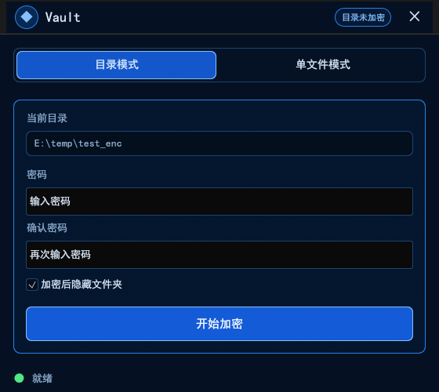
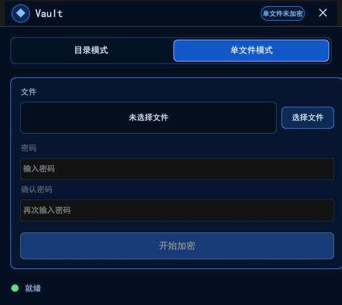

# Vault

[English](README_EN.md)

轻量级 Windows 文件与文件夹加密工具。编译为单个 exe，无需安装。

## 功能特性

- **目录模式** — 将 exe 放入任意文件夹，双击运行即可一键加密/解密目录下所有文件和子目录，文件名和目录名同步加密
- **单文件模式** — 加密单个文件，元数据自包含，加密文件可独立分享，接收方只需相同 exe 和密码即可解密还原
- **文件夹隐藏** — 可选通过 Windows CLSID 重命名技术隐藏加密目录，在资源管理器中不可见
- **拖拽支持** — 将文件拖入窗口即可自动切换到单文件模式并选中该文件
- **零安装** — 编译为单个 `.exe`（约 4MB），无运行时依赖

## 界面预览

| 目录模式 | 单文件模式 |
|:-:|:-:|
|  |  |

## 快速开始

### 下载

从 [Releases](../../releases) 获取最新的 `vault.exe`。

### 从源码构建

```bash
cargo build --release
```

产出：`target/release/vault.exe`

需要 Rust 1.70+ 和 Windows 环境。

## 使用方式

### 目录加密

1. 将 `vault.exe` 复制到目标文件夹
2. 双击运行
3. 程序自动检测未加密状态，显示加密界面
4. 设置密码，可选勾选"加密后隐藏文件夹"
5. 点击 **开始加密**
6. 加密完成后可带走 exe — 目录中只剩乱码文件名和不可读的文件内容

### 目录解密

1. 将 `vault.exe` 放回加密目录
2. 双击运行
3. 程序自动检测已加密状态，显示解密界面
4. 输入密码，点击 **开始解密**
5. 所有文件、文件名、目录结构和时间戳完整还原

### 单文件加密 / 解密

1. 运行 `vault.exe`（任意位置均可）
2. 切换到 **单文件** 标签页
3. 选择文件（或拖拽文件到窗口），设置密码，点击 **开始加密** / **开始解密**

## 加密方案

### 总览

| 组件 | 算法 |
|---|---|
| **内容加密** | AES-256-CTR（32 位大端计数器） |
| **密钥派生** | PBKDF2-HMAC-SHA256，100,000 次迭代 |
| **盐值（Salt）** | 16 字节，每文件独立 CSPRNG 随机生成 |
| **随机数（Nonce）** | 16 字节（128 位），每文件独立 CSPRNG 随机生成 |
| **元数据完整性** | CRC32 校验和 |
| **文件名加密** | AES-256-CTR，确定性盐值 |

### 内容加密

每个文件使用 **AES-256-CTR** 加密，密钥由用户密码派生，每文件独立。

```
密码 + 盐值 (16B, 随机) ──► PBKDF2-HMAC-SHA256 (100k 轮) ──► 256 位密钥
密钥 + 随机数 (16B, 随机) ──► AES-256-CTR ──► 密文
```

**大文件部分加密（> 128 KiB）：** 仅加密文件头部和尾部各 64 KiB，中间内容不动，大文件处理接近瞬间完成。小文件（<= 128 KiB）整体加密。

### 元数据结构

每个加密文件末尾追加元数据块：

```
┌─────────────────────────────────────────────────┐
│ 魔术字       "VALT" (4 字节)                    │
│ 盐值         (16 字节, 明文)                     │
│ 随机数       (16 字节, 明文)                     │
│ 元数据随机数 (16 字节, 明文)                     │
│ 加密载荷:                                       │
│   ├─ 原始文件名     (u16 长度 + UTF-8)          │
│   ├─ 原始文件大小   (u64 小端)                  │
│   ├─ 原始修改时间   (i64 小端, Unix 秒)         │
│   └─ CRC32 校验和   (u32 小端)                  │
│ 总长度               (u32 小端, 位于文件末尾)    │
└─────────────────────────────────────────────────┘
```

载荷使用独立的随机数（`meta_nonce`）加密，确保元数据与文件内容的密钥流互不重叠。

### 文件名加密

文件名和目录名采用确定性加密（相同密码 + 相同名称 = 相同密文），便于目录级操作而无需维护名称映射表：

```
密码 + 固定盐值 ──► PBKDF2 ──► 密钥
密钥 + 零随机数 ──► AES-256-CTR(名称) ──► 十六进制编码 + ".dat"
```

### 安全说明

- **CTR 模式仅提供机密性** — 不提供完整性和认证。CRC32 校验和用于防止意外损坏和密码错误检测，但不是加密级消息认证码
- **部分加密** 会泄露大文件（> 128 KiB）的中间部分，这是速度与安全性的有意权衡
- **确定性文件名加密** 意味着相同文件名产生相同密文，会泄露名称相等性
- **PBKDF2 100k 轮迭代** — 合理但非最高标准，内存硬型 KDF（如 Argon2）对 GPU/ASIC 攻击具有更强的抵抗力

## 项目结构

```
src/
├── main.rs          # 程序入口，窗口配置，字体加载
├── app.rs           # GUI 界面（egui），模式检测，用户交互
├── crypto.rs        # AES-256-CTR 加密，PBKDF2 密钥派生
├── file_ops.rs      # 文件加密/解密（部分或完整）
├── dir_ops.rs       # 递归目录加密/解密
├── name_encrypt.rs  # 确定性文件名/目录名加密
├── metadata.rs      # 元数据结构体，序列化，检测
├── folder_hide.rs   # Windows CLSID 文件夹隐藏
├── validate.rs      # 加密前校验
└── error.rs         # 错误类型
```

## 依赖

| Crate | 用途 |
|---|---|
| `aes` + `ctr` | AES-256-CTR 密码算法 |
| `pbkdf2` + `sha2` | PBKDF2-HMAC-SHA256 密钥派生 |
| `rand` | CSPRNG 安全随机数生成 |
| `crc32fast` | CRC32 完整性校验 |
| `hex` | 加密文件名十六进制编码 |
| `walkdir` | 递归目录遍历 |
| `filetime` | 保留文件修改时间 |
| `eframe` + `egui` | 跨平台 GUI 框架 |
| `rfd` | 原生文件选择对话框 |

## 许可证

MIT
